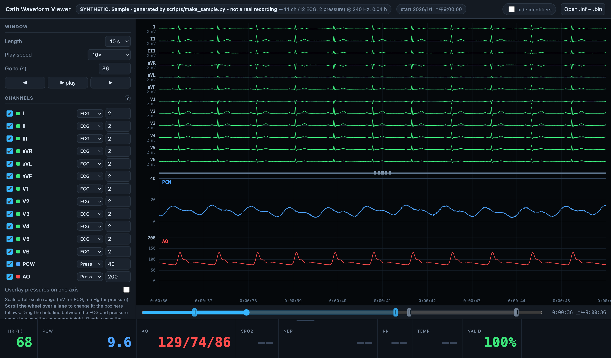
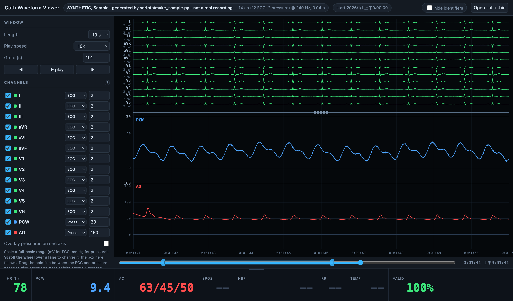
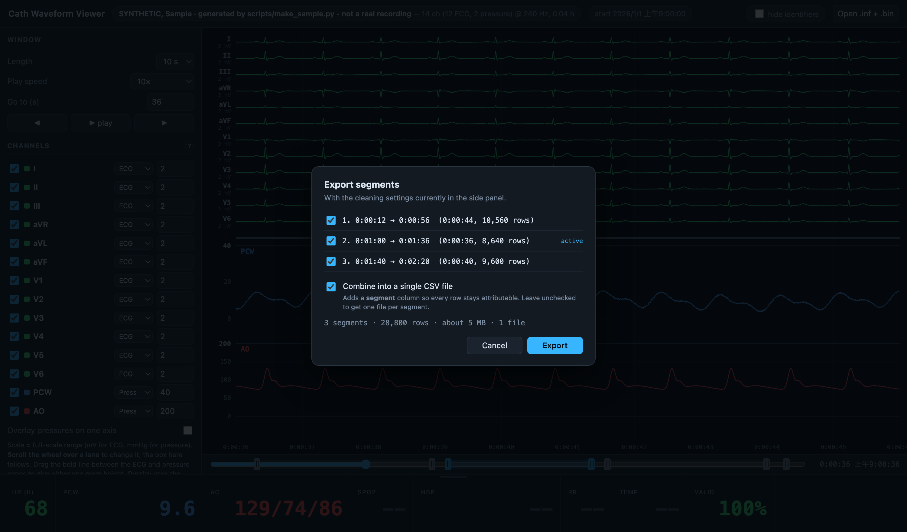

# Cath Waveform Viewer

Browse and export the raw waveform files a GE cath-lab hemodynamic recorder writes —
12-lead ECG plus invasive pressures, hours of it, at full sample rate.

Two pieces, usable separately:

- **`viewer/cath_viewer.html`** — a single HTML file. Double-click it, pick a case's
  `.inf` and `.bin`, and it plays back like the Mac-Lab real-time panel. No install, no
  Python, no server. Nothing is uploaded.
- **`scripts/clean_export.py`** — the same cleaning, run over a whole recording in batch,
  producing analysis-ready CSV.



*All screenshots use the synthetic sample in `sample/`, not a patient recording.*

## Try it in thirty seconds

1. Download or clone this repository.
2. Open `viewer/cath_viewer.html` in Chrome, Edge, Safari, or Firefox.
3. Click **Open .inf + .bin** and select **both** files from `sample/` at once.

That sample is generated by `scripts/make_sample.py` — sine and Gaussian terms, no
recording behind it. It deliberately contains the artefacts real exports carry, so the
cleaning controls have something to act on.

## Why this exists

The exported `.bin` is a headerless block of little-endian `float64`, **sample-interleaved**
(all channels at t=0, then all channels at t=1). The `.inf` sidecar gives the channel count,
names, and sample rate, and nothing else. There is no event log, no annotation stream, and
no NBP or SpO2 channel — just the waveforms.

Two traps in the raw signal will quietly corrupt an analysis:

- **The pressure channels wrap.** Above the +409.4 mmHg full scale (2047 × 0.2), the stored
  value wraps by exactly 65536 counts and reads about −12,700 mmHg. A flush does this
  routinely. Unfixed, it destroys any mean or filter over the channel.
- **Saturated ECG samples masquerade as normal.** At the ADC rail the samples carry no
  information, but if a beat's PR baseline and its J-point are both pinned they differ by
  exactly zero — so an ST algorithm reports a confident, perfectly normal ST segment for a
  beat it cannot see.

Both are handled, and both are visible and adjustable rather than hidden.

## Adjusting the display

Drag the bold line between the ECG and pressure panes to give either one more height —
useful when a low wedge and a high arterial line share the screen. Scroll the wheel over
any lane to change its scale.



*The pressure pane enlarged, showing a transient damped-pressure episode: AO falls to
63/45/50 while the wedge and heart rate barely move.*

## Trimming and exporting

A recording starts before the patient is on the table and ends after everything is
disconnected, so both ends are meaningless signal. Mark **In** and **Out** on the track
(handles drag directly, and the display follows), or let **Auto-detect** find the first and
last moment a pressure transducer is live. Add more segments when a case needs splitting.



Export the current window, any set of segments, or the whole study — cleaned or exactly as
recorded. Segments can go to one file each, or be combined into a single CSV with a
`segment` column so every row stays attributable.

Whatever you set in the viewer, the Export panel writes the matching `clean_export.py`
command, including `--start`/`--stop`. Tune it by eye, then run the batch script over the
whole recording with exactly those parameters.

## The batch script

```bash
python scripts/clean_export.py sample/SYNTH01           # cleaned, validated defaults
python scripts/clean_export.py sample/SYNTH01 --raw     # untouched, decide for yourself
python scripts/clean_export.py sample/SYNTH01 --no-baseline --sat-threshold 4.5
```

Writes into `<parent>/derived/`:

| file | contents |
|---|---|
| `<stem>_clean.csv` / `<stem>_raw.csv` | one row per sample: `timestamp`, `t_sec`, every channel |
| `<stem>_{clean,raw}_trend.csv` | one row per second: HR, pressure mean/min/max, per-channel validity |
| `<stem>_{clean,raw}_qc.txt` | the exact command used, and what each step removed |

Every cleaning step is a flag, so nothing is imposed. Removed samples are written as **empty
fields — never zeros, never interpolated** — so aggregate with `nanmean`, not `mean`.

On a 5.4-hour, 519 MB recording the full export takes about 48 seconds.

`scripts/README_cleaning.md` documents each step, the evidence behind the default, and the
validation numbers. Read it before changing a threshold.

## Privacy

**No patient data is in this repository, and the viewer never transmits any.**

The page reads the `.bin` straight off local disk through the browser's file API, a few
seconds of signal at a time — there is no network code in the file at all. That is also why
it is not hosted anywhere: you hand colleagues the HTML file and each person opens it
against their own copy of the data.

A **hide identifiers** toggle blanks the patient name for screenshots, teaching, and screen
sharing. `.gitignore` excludes `Data/`, every `derived/` folder, and all `.bin`/`.inf`/`.csv`
files except the named synthetic sample.

Every recording is different. Check a new file in the viewer before deciding how to
pre-process it — the defaults here were derived by measuring one recorder, and the script
tells you what it did to every channel.

## Requirements

- **Viewer:** a current browser. Chrome and Edge stream large exports straight to disk;
  Safari and Firefox build them in memory, so the viewer warns above about 400 MB.
- **Script:** Python 3.10+ with `numpy`, `scipy`, `pandas`.

## Repository layout

```
viewer/cath_viewer.html      the whole application, one file
viewer/README.md             every control, and what it does
scripts/clean_export.py      batch cleaning and CSV export
scripts/README_cleaning.md   each cleaning step, its evidence, its validation
scripts/make_sample.py       regenerates the synthetic sample
sample/SYNTH01.{inf,bin}     150 s of synthetic signal to try it on
docs/                        screenshots
```

## Status

Working and in use, but young. The viewer's in-browser filters are one-pole
forward+backward and are meant for previewing a setting; the batch script uses Butterworth
`filtfilt`, so trust the CSV rather than the screen for filtered numbers. The heart rate in
the readout panel is a per-window slope detector for orientation, not a validated
arrhythmia algorithm — though it agrees exactly with the batch detector across the sampled
test points.
